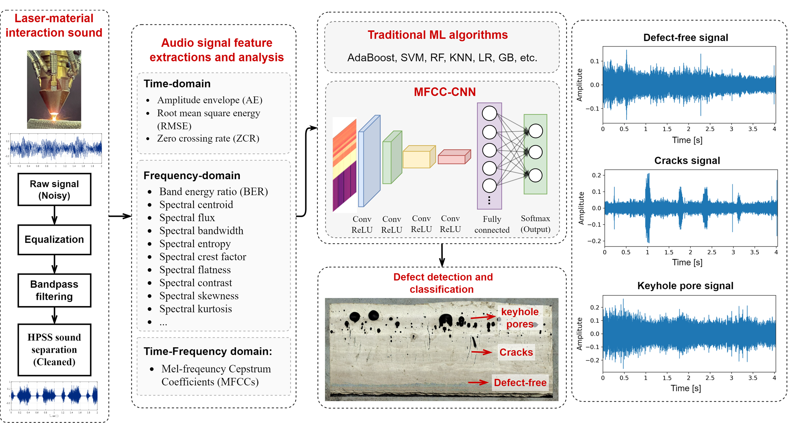

# AM audio signal ML for defect detection
 This repository contains code for audio feature extraction and machine learning for LDED AM process defect detection (classification).

# Acoustic-Based In-Situ Defect Detection in LDED

## Overview



This repository contains the implementation and dataset used in the paper:

**Chen, L., Yao, X., Tan, C., He, W., Su, J., Weng, F., Chew, Y., Ng, N.P.H., & Moon, S.K. (2023).** In-situ crack and keyhole pore detection in laser directed energy deposition through acoustic signal and deep learning. *Additive Manufacturing*, 103547. [DOI: https://www.sciencedirect.com/science/article/abs/pii/S2214860423001604](https://www.sciencedirect.com/science/article/abs/pii/S2214860423001604)

This study explores the use of acoustic signals for real-time defect detection in Laser Directed Energy Deposition (LDED) processes. By leveraging deep learning techniques, the method achieves accurate classification of defects such as cracks and keyhole pores, providing a non-destructive means for process monitoring and quality control.

## Highlights
- **In-situ Acoustic Monitoring**: Uses real-time acoustic signals for detecting defects in LDED.
- **Deep Learning-based Classification**: Implements deep neural networks to classify defect types.
- **Keyhole Pores & Cracks Detection**: Focuses on identifying key defect types in metal additive manufacturing.

## System Requirements
To run this repository, ensure your environment meets the following requirements:

- **Operating System**: Ubuntu Linux
- **Python Version**: 3.9
- **CUDA Version**: 11.0
- **Dependencies:**
  ```bash
  pip install tensorflow==2.4.0
  pip install scikit-learn==1.1.3
  pip install pyAudioAnalysis==0.3.14
  pip install acoustics==0.2.6
  pip install librosa
  pip install scikit-learn-intelex
  pip install dpctl
  pip install natsort
  ```

## Citation
If you use this repository in your research, please cite our work as follows:

```
@article{chen2023insitu,
  author    = {Chen, Lequn and Yao, Xiling and Tan, Chaolin and He, Weiyang and Su, Jinglong and Weng, Fei and Chew, Youxiang, Yi and Moon, Seung Ki},
  title     = {In-situ crack and keyhole pore detection in laser directed energy deposition through acoustic signal and deep learning},
  journal   = {Additive Manufacturing},
  volume    = {72},
  pages     = {103547},
  year      = {2023},
  publisher = {Elsevier},
  url       = {https://www.sciencedirect.com/science/article/abs/pii/S2214860423001604}
}
```

